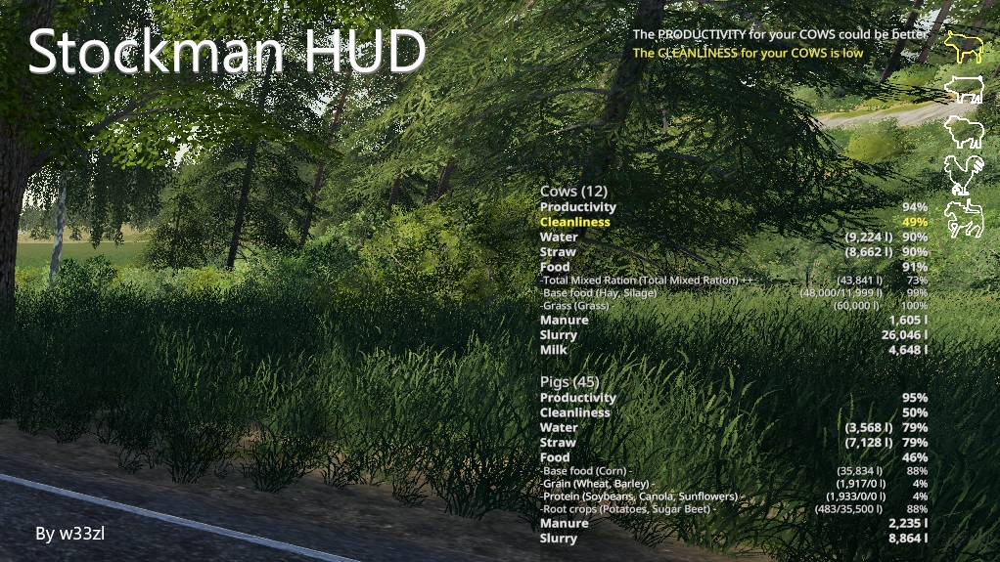

# Stockman for Farming Simulator 19

> _**Please note:** 
> 
> Bugs and feature requests, as well as general mod updates, are tracked and managed on the
> **[project page for Stockman](https://mikaelleven.myjetbrains.com/youtrack/projects/164c8cbe-c2da-47bb-834b-9ee770fadc11)**!
>   _

Stockman HUD gives you an overview of your animal husbandry with alerts and summaries of performance indicators (key statistics). This helps you be effective when caring for your livestock.

The mod is inspired by the great AnimalsHUD from xDeekay but with more focus on alerts and selective information as well as being built specifically for Seasons.

## FEATURES: 

* Icons displays the overall status and performance for each animal type (the color of the icon indicates the overall status)
* Alerts gives you brief messages of the most urgent things to attend to (low food, shortage on water etc)
* Stockman automatically displays a summary for a particular pen when you get nearby
* You can choose to display an total overview of all your pens regardless of where you are on your farm (or on the map)
* Stockman is optimized for Seasons (alerts and thresholds are adjusted to reflect that Seasons limits so you can have no more than two days worth of food etc so you need to attend to your animals each day)
* The text in the overview and pen-info overlays is shaded and displayed on a semi-transparent black background for good visibillity in most situations

## HOW IT WORKS: 
In normal mode, which is the default when you load your savegame, there are three parts that are active:
1) The icons displaying which animal pens you have
2) The alerts adjacent to the icons (only if there are any stats behlow the thresholds)
3) The automatic pen info overlay which is displayed when getting close to any of your animal pens

Additionally you can manually disable the automatic pen info or show a full overview of all your pens. You can toggle this behavior with the bindable hotkey (default F9) and cycle through these three states:

A) Show popup only for nearby pen (default) 

B) Show popup with full overview

C) Disabled / no popup info

## INSTALLATION: 
1. Download the mod (zip-file) from Giants ModHub: https://farming-simulator.com/mod.php?mod_id=149147
2. Copy the zip-archive to your mods-folder
3. Activate the mod when loading your savegame
4. Enjoy

## LIMITATIONS AND KNOWN ISSUES: 
* Currently only supports one pen per animal type
* Optimized and tested for Seasons (might work quite well for the vanilla game also, but this is unverified)
* No settings to manually disable the alerts and icons
* No translations, everything is (currently) in english (however there are prepared translation files if anyone would be inclined to translate) 

## BUGS AND FEATURE REQUESTS:
If you have experienced a bug or if you got a suggestion or feature request, head over to my [Stockman Project Page]( https://mikaelleven.myjetbrains.com/youtrack/projects/164c8cbe-c2da-47bb-834b-9ee770fadc11). There you can see status of all reported issues and post your own issues/requests.
